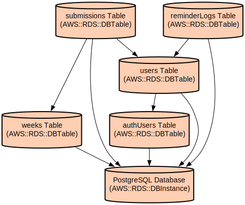

# Pulse

Pulse is a modern web application that simplifies team progress tracking and feedback collection through structured weekly check-ins. The application enables teams to maintain consistent communication, track project hours, and gather valuable insights while minimizing administrative overhead.

The application provides a streamlined multi-step form interface for team members to submit their weekly updates, including project allocations, working hours, manager feedback, and other relevant information. For administrators, it offers comprehensive dashboards to monitor submission status, send reminders, and manage user data. The system integrates with Google authentication for secure access and uses Supabase for robust data management.

## Current Status

### Implemented Features
- Multi-step submission form
- Google and Magic Link authentication
- Basic form validation
- Mobile-responsive design
- Project and hours tracking
- Manager feedback collection

### In Development
- Admin dashboard and analytics
- Automated reminder system
- Historical data view
- Data export functionality

## Repository Structure
```
.
├── src/                      # Source code directory
│   ├── app/                 # Next.js app router pages and API routes
│   ├── components/          # React components (unit tests co-located)
│   ├── lib/                 # Utility functions for email and general helpers
│   ├── test/                # Unit test setup files
│   ├── types/              # TypeScript type definitions
│   └── utils/              # Utility functions for dates, Supabase, and actions
├── e2e/                     # End-to-end tests (Playwright)
├── supabase/                # Database migrations and configuration
│   └── migrations/         # SQL migration files
├── docs/                    # Project documentation
└── public/                 # Static assets
```

## Usage Instructions
### Prerequisites
- Node.js 18.x or later
- PostgreSQL 15.x (Supabase)
- Supabase account and one project for each environment
- Google OAuth credentials (via Supabase Auth Providers)
- pnpm package manager

### Installation

1. Clone the repository:
```bash
git clone <repository-url>
cd pulse
```

2. Install dependencies:
```bash
pnpm install
```

3. Set up environment variables:
```bash
# set up database, email, and other services
cp .env.example .env
# set up google login via supabase
cp supabase/.env.example supabase/.env
```

4. Start local Supabase:
```bash
supabase start
```

5. Initialize the database:
```bash
supabase db reset
```

6. Start the development server:
```bash
pnpm dev
```

### Quick Start
1. Navigate to the application URL
2. Sign in using your Google account or Magic Link
3. Complete the weekly pulse form:
   - Select your primary project
   - Enter hours worked
   - Provide manager information
   - Add any additional projects
   - Submit feedback and additional information

### Form Data Structure
```typescript
// Example form data structure
const formData = {
  userId: string,
  email: string,
  weekNumber: number,
  primaryProject: { 
    name: string, 
    hours: number 
  },
  additionalProjects: Array<{
    project: string,
    hours: number
  }>,
  manager: string,
  feedback: string
};
```

### Troubleshooting
#### Common Issues
1. Supabase Connection Issues
   - Check if Supabase is running locally (`pnpm supabase status`)
   - Ensure `.env` file contains valid `SUPABASE_URL` and `SUPABASE_ANON_KEY`.
   - Try restarting Supabase (`pnpm supabase stop && pnpm supabase start`)
   - Verify Supabase project status in the Supabase dashboard if using remote.

2. Authentication Failures
   - Error: "Failed to sign in with Google"
   - Solution: Verify Google OAuth credentials in Supabase dashboard
   - Check allowed redirect URLs
   - Ensure environment variables are properly set
   - Clear browser cache and try again

3. Development Environment
   - Issue: Hot reload not working
   - Solution: Check for file watching limits
   - Restart development server
   - Clear Next.js cache (`rm -rf .next`)

## Data Flow
Weekly Pulse manages data flow through a structured submission process, from user input to administrative review.

```ascii
User Input → Form Validation → API Submission → Database Storage
     ↑                                              ↓
Google Auth ←→ Supabase Auth ←→ Admin Dashboard ←→ Reports
```

Key Component Interactions:
1. User authentication through Google OAuth via Supabase
2. Form data collection through multi-step interface
3. Server-side validation and processing
4. Database storage with Supabase
5. Administrative review and management interface
6. Automated reminder system for missing submissions
7. Report generation and data export capabilities

## Infrastructure


### Database Resources
- PostgreSQL database with the following tables:
  - `auth.users`: Authentication user data
  - `users`: Application user profiles
  - `weeks`: Weekly submission windows
  - `submissions`: User submission data
  - `reminder_logs`: Reminder tracking

### Scheduled Tasks
- Weekly submission window generation
- Automated reminder system
- Database migrations

## Deployment
### Prerequisites
- Vercel account
- Supabase project
- Environment variables configured

### Production Deployment
1. Configure environment variables in Vercel
2. Connect repository to Vercel
3. Deploy:
```bash
pnpm build
vercel --prod
```

### Staging Deployment
1. Create separate Supabase project for staging
2. Configure staging environment variables
3. Deploy to staging:
```bash
vercel
```

## Testing

This project uses Vitest for unit testing and Playwright for end-to-end (E2E) testing.

### Unit Tests (Vitest)

- **Run all unit tests:**
  ```bash
  pnpm test:run
  ```
- **Run unit tests in watch mode:**
  ```bash
  pnpm test
  ```
- **Run unit tests with UI:**
  ```bash
  pnpm test:ui
  ```
- **Generate coverage report:**
  ```bash
  pnpm test:coverage
  ```

### End-to-End Tests (Playwright)

- **Run all E2E tests:**
  ```bash
  pnpm test:e2e
  ```
- **Run E2E tests with UI mode:**
  ```bash
  pnpm test:e2e:ui
  ```
- **Run E2E tests in debug mode:**
  ```bash
  pnpm test:e2e:debug
  ```
- **Run E2E tests specifically for Chromium:**
  ```bash
  pnpm test:e2e:chromium
  ```
- **Generate code for E2E tests:**
  ```bash
  pnpm test:e2e:codegen
  ```